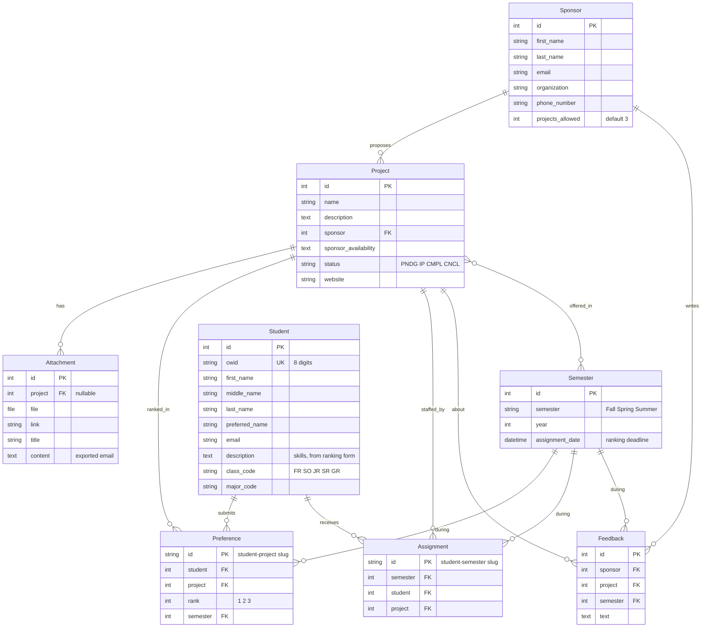

# Data Model

**Audience:** developers. Describes the database as it exists today (inherited from v1) and the changes we have decided to make.

Source of truth is `backend/user/models.py` and `backend/project/models.py`. Regenerate the diagram when those change.

## Current schema (v1, as of 2026-09-22)

Constraints that exist: `Project(name, sponsor)` unique; `Semester(semester, year)` unique; `Student.cwid` unique; `Assignment` primary key is student plus semester, so one assignment per student per semester.

## What is wrong with it

From [docs/investigations/v1-reference.md](../investigations/v1-reference.md):

- No user record and no role column. Identity comes only from the Auth0 token; a student and a sponsor are rows in two unrelated tables keyed by a non-unique email.
- `Project.status` is set by hand and never derived from whether the project was assigned.
- No team concept and no per-project capacity. "Team" is implicitly every student assigned to the same project.
- `Preference` has no database uniqueness on (student, project, semester); it relies on the slug primary key.
- The ranking deadline (`Semester.assignment_date`) is enforced only in the browser.
- `Semester.year` maximum is computed at import time.

## Planned changes (Iteration 1 and 2)

| Change | Why | Where |
|---|---|---|
| Add `AppUser(email unique, role, is_active, created_at)` linked one-to-one to `Student` or `Sponsor` | Server-side role per [ADR-002](../decisions/ADR-002-auth.md) | new table |
| Make `Sponsor.email` and `Student.email` unique | One account per person | constraint |
| Add `Project.capacity` (int, default 4) | Team size limit the admin can set | column |
| Add `Team` (project, semester) with `Assignment.team` FK, or derive team = assignments grouped by project and semester | Depends on the sponsor's answer on team-preference input; decide after the sponsor meeting | pending |
| Unique constraint on `Preference(student, project, semester)` | Prevent duplicates at the database, not the client | constraint |
| Server-side check: reject preference writes after `Semester.assignment_date` | Deadline correctness | view |
| Derive `Project.status` from assignment state; keep a manual override for Cancelled | Remove a manual admin step | model method |
| Unique `Project(name)` per semester | Prior team's open bug #34 | constraint |
| `assigned_by`, `assigned_at` on `Assignment` | Audit trail if more than one admin | columns |

Anything requiring a migration goes through a pull request with a test.

## Scale assumptions

Under 100 users per semester, one traffic spike when rankings are due. No scaling work. Correctness is enforced by database constraints and the server-side deadline check, not by application-level locking.
